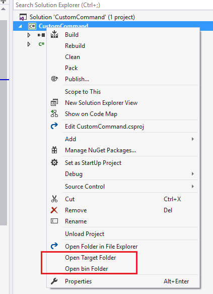
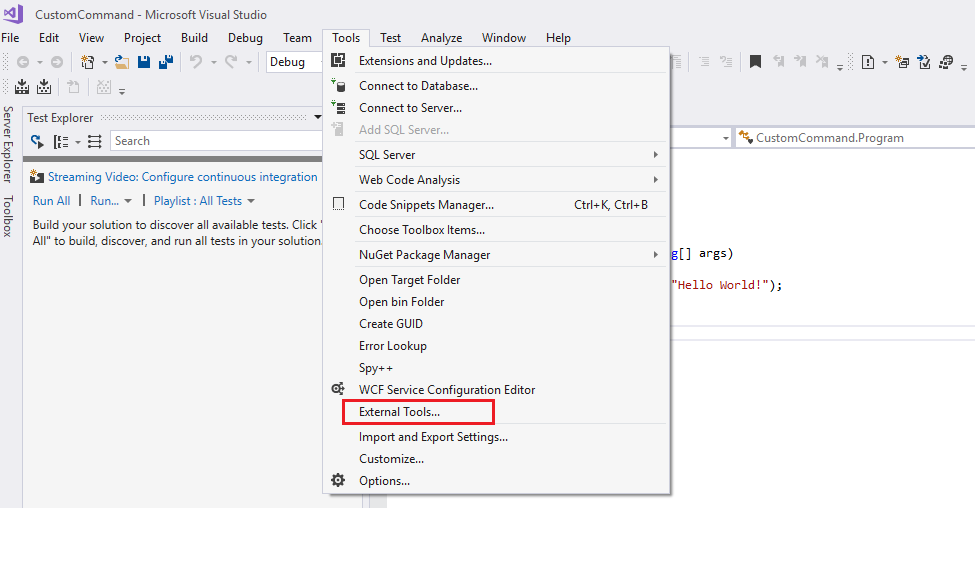
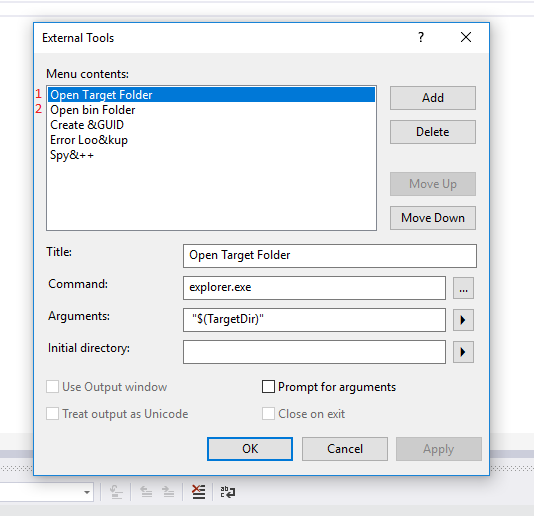

# Adding custom commands to Visual Studio 2017 - Open "build target" and "bin" folders

For some projects the build output, and the project output are not always obvious. Here I show how one can add an easy to use contextual menu for getting those directories. This will also include a guide on creating your own custom commands. 

```
Target Directory $(TargetDir)	The directory of the primary output file for the build (defined as drive + path); includes the trailing backslash '\'.
Binary Directory $(BinDir)	The final location of the binary that is being built (defined as drive + path). For example:\...\My Documents\Visual Studio <Version>\<ProjectName>\bin\debug

```
This is how the end result should look like:




## 1. First we create our own custom commands

I'll show how one can add one command, `TargetDir`, and the rest can easily be created by changing the `Command` and `Arguments` parameters. 

We first open the `External Tools` tab from the `Tools` menu:



Fill in the fields. 



Give the command an easily recognizable title. The `Command` field must be `explorer.exe` and the `Arguments` must be ` "$(TargetDir)"`. 
