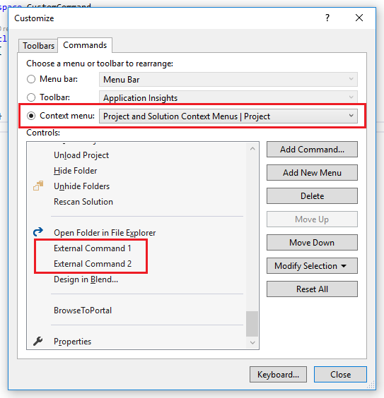
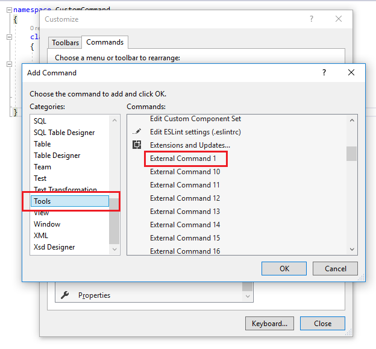

# Adding custom commands to Visual Studio 2017 - Open "build target" and "bin" folders

For some projects the build output, and the project output are not always obvious. Here I show how one can add an easy to use contextual menu for getting those directories. This will also include a guide on creating your own custom commands. 

```
Target Directory $(TargetDir)	The directory of the primary output file for the build (defined as drive + path); includes the trailing backslash '\'.
Binary Directory $(BinDir)	The final location of the binary that is being built (defined as drive + path). For example:\...\My Documents\Visual Studio <Version>\<ProjectName>\bin\debug

```
This is how the end result should look like:


## 1. First we create our own custom commands

I'll show how one can add one command, `TargetDir`, and the rest can easily be created by changing the `Command` and `Arguments` parameters. 

We first open the `External Tools` tab from the `Tools` menu:


Fill in the fields. 


Give the command an easily recognizable title. The `Command` field must be `explorer.exe` and the `Arguments` must be ` "$(TargetDir)"`. Take special note of the order of the external commands you added. `Open Target Folder` is first in the list. This means it corresponds to `External Command 1`. By the same logic, `Open bin Folder` corresponds to `External Command 2`. 

## 2. Add the command to the menu

Once we created our own command, we just need to add it to the appropriate menu. For this specific scenario, we will add it as part of the Project contextual menu, but this can be changed as per the user's needs. 

Open the `Tools > Customize` menu. Switch to the `Commands` tab. Select `Context menu` and scroll down to `Project and Solution Context Menus | Project`.  



Click `Add Command` to add the command we previously created. You will be shown a dialogue that lets you select it:



And here the order of the external commands is important. As previously shown, `Open Target Folder`corresponds to `External Command 1`. So we select `Tools` and `External Command 1`. Use `Move Up` and `Move Down` to get the command in the right place. 


The same can be done for `Binary Directory` or any other command you might wish to add to your UI. 

VS arguments references:
[Managing External Tools](https://msdn.microsoft.com/en-us/library/76712d27.aspx) 

[Common Macros for Build Commands and Properties](https://msdn.microsoft.com/da-dk/library/c02as0cs.aspx) 
